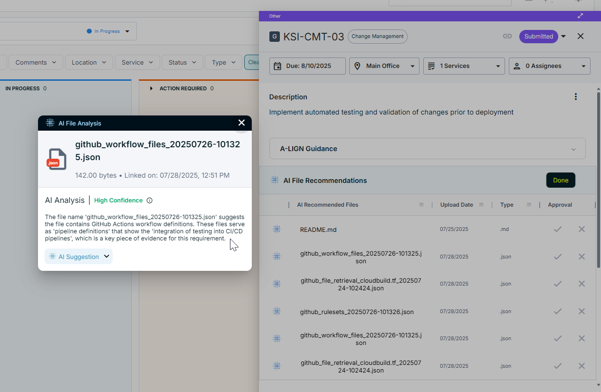
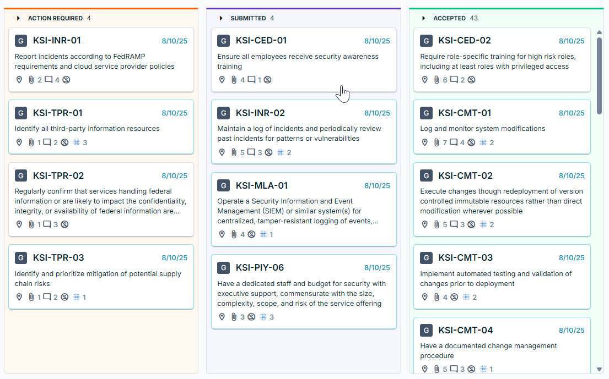

# A-LIGN FedRAMP 20x Pilot Submission

# Overview

  

This repository contains A-LIGN's submission of the A-SCEND product for the FedRAMP 20x pilot program. A-SCEND is an
AI-powered audit management platform supported by certified practitioners with over 20 years of experience. The platform
is designed to automate and streamline the audit and compliance process.

# CSP and 3PAO Approach

The CSP's (Cloud Service Provider) and 3PAO's (Third-Party Assessment Organization) approach to a FedRAMP 20x audit is a
streamlined, technology-driven process focused on automation and efficiency. The core of this approach is the use of the
A-SCEND platform and its AI-powered features, which significantly reduces manual effort for both parties.

## CSP's Approach

The CSP focuses on automating evidence collection and leveraging AI to prepare for the audit. Their process involves the
following key steps:

* **Automated Evidence Generation**: The CSP configures its internal systems to automatically generate, where possible,
  machine-readable security evidence, such as logs, configuration files, and asset inventories. This eliminates manual
  document creation and ensures consistency and accuracy.
* **Continuous Monitoring**: The CSP continuously monitors its compliance against the FedRAMP 20x KSIs and hosts these
  results on a public trust page. This provides ongoing visibility into the CSP's security posture.
* **Uploading and AI-Assisted Matching**: The CSP uploads this machine-readable evidence to the A-SCEND platform. It
  then uses A-SCEND's AI Evidence Matching feature to assist in matching the uploaded files to the relevant FedRAMP 20x
  KSIs (Key Security Indicators).
* **Submission**: After matching the evidence file to the appropriate KSI, the CSP formally submits the evidence to the
  3PAO for review.

## 3PAO's Approach

The 3PAO's role is to efficiently review and validate the evidence provided by the CSP. They use AI to accelerate their
review process, which includes:

* **AI-Assisted Review**: The 3PAO leverages A-SCEND's AI Testing Notes feature. This tool generates detailed
  explanations for each evidence file, clarifying how it meets the requirements of the associated KSI.
* **Acceptance or Rejection**: Based on their review, the 3PAO either accepts the evidence, confirming compliance, or
  rejects it with feedback. If rejected, the CSP must provide new evidence and resubmit.
* **Final Export**: Once all KSIs have been successfully reviewed and accepted, the entire authorized package, including
  the status of each KSI and the associated evidence, is exported as a machine-readable JSON file.

# Process Flow

## Step 1: Auto-Generating Evidence

The process begins with the automatic generation of security evidence. Wherever possible, the CSP's internal systems and
security tools are configured to generate artifacts and data in a machine-readable format. This process is designed to
be flexible and generic, allowing any informational resource accessible via an HTTP request to be configured as an
evidence source. This can include system logs, configuration files, asset inventories, and policy-as-code files.

### Example: Gathering evidence from Google Cloud Platform (GCP)

1. **Authentication**: Authenticate with the GCP API using OAuth to get a JWT.
2. **HTTP Request**: Perform an HTTP request to the target GCP API endpoint, including the JWT for authorization. The
   system has retry logic to handle temporary failures, while a persistent failure will result in a workflow error.
3. **Parsing**: Parse the JSON response from the API.
4. **Storage**: Store a structured representation of the response data.
5. **Testing**: Perform the necessary tests on the gathered evidence.
6. **Store Results**: Store the results of the tests.

## Step 2: Uploading Files to A-SCEND

Once the evidence is generated, the CSP uploads the files directly to the A-SCEND platform, which acts as the central
repository for all FedRAMP authorization-related evidence.

## Step 3: AI-Assisted Evidence Matching

The CSP uses A-SCEND's AI Evidence Matching feature to analyze the machine-readable evidence and suggest associations
between the uploaded files and the relevant FedRAMP 20x KSIs. This feature reduces the manual effort needed to link
files to specific security controls or to find where a single file can satisfy multiple KSIs. The CSP then reviews and
confirms these suggested matches.

## Step 4: Submitting Evidence for 3PAO Review

After associating all relevant evidence files to a specific A-SCEND request, the CSP submits the request for review.
This submission signals to the 3PAO (Third-Party Assessment Organization) that the evidence is ready for their
examination.

## Step 5: AI-Assisted Evidence Review (AI Testing Notes)

The 3PAO begins its review using A-SCEND's AI Testing Notes feature. This tool generates a detailed response for each
evidence file, explaining how it meets the requirements of the associated KSI. This AI-powered write-up helps the 3PAO
quickly understand the context and purpose of each piece of evidence, leading to a more efficient review.

## Step 6: 3PAO Acceptance or Rejection

Based on the review, the 3PAO makes a decision on each evidence request:

* **Accept**: The 3PAO accepts the evidence, confirming that it adequately demonstrates compliance with the KSI.
* **Reject (Action Required)**: The 3PAO rejects the evidence and provides feedback on why it was deemed insufficient or
  incomplete. The CSP must then address the feedback, provide new evidence, and resubmit the request.

## Step 7: Exporting the Final Package

Once all KSIs have been successfully reviewed and accepted by the 3PAO, the entire authorization package can be exported
from A-SCEND as a JSON file. This JSON structure provides a machine-readable summary of the authorization, including:

* The list of all FedRAMP Low 20x KSIs with their status and test results.
* A direct reference to all linked evidence files.
* Write-ups summarizing what the evidence is and how it meets each KSI.
* Finding and finding responses where KSI’s were not fully met.
* A zip folder of all the evidence files reviewed during the assessment will also be exported to accompany the package.

